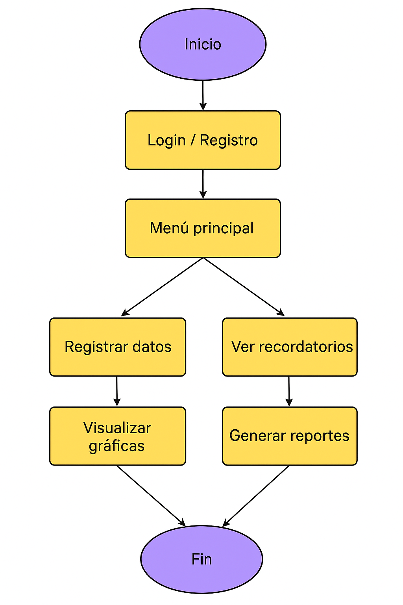
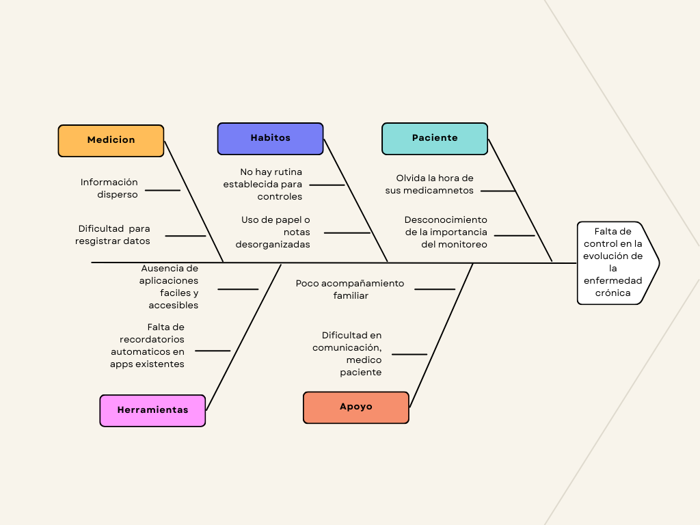

# MediTrack
## Propuesta Proyecto Grado

### Planteamiento del problema

Las enfermedades crónicas como la diabetes, la hipertensión y el asma requieren un monitoreo constante de indicadores de salud y un estricto cumplimiento en la toma de medicamentos. Sin embargo, muchos pacientes presentan dificultades para:
- Recordar la hora de sus tratamientos.
- Registrar y dar seguimiento a sus valores médicos (glucosa, presión arterial, peso, etc.).
- Entregar información organizada a su médico durante las consultas.
  
Esto ocasiona falta de control en la evolución de la enfermedad, aumenta el riesgo de complicaciones y dificulta la comunicación entre médico y paciente.

### Solución propuesta
La solución propuesta consiste en el desarrollo de una aplicación móvil que sirva como apoyo a los pacientes con enfermedades crónicas en el seguimiento de su estado de salud. Esta herramienta permitirá registrar de manera sencilla los datos médicos relevantes, ofreciendo al usuario la posibilidad de consultar gráficas y reportes de su evolución en el tiempo. Además, integrará un sistema de recordatorios que notificará al paciente sobre la toma de medicamentos y la realización de controles médicos, facilitando así el cumplimiento de su tratamiento.

### Nota:
La aplicación estaría enfocada en ayudar a pacientes con enfermedades crónicas (como diabetes, hipertensión o asma) a llevar un registro sencillo de su salud diaria y cumplir con sus tratamientos.
El sistema **NO** sustituye al médico, pero facilita el autocontrol y genera reportes útiles para consultas.

### ⚙️Funcionalidades (susceptible a cambios)

1. Registro de usuario/paciente con perfil básico (nombre, edad, diagnóstico).
2. Ingreso de datos de salud por ejemplo:
    - Diabéticos: niveles de glucosa, alimentación, dosis de insulina.
    - Hipertensos: presión arterial, frecuencia cardíaca.
    - Otros: peso, actividad física).

3. Alarmas/recordatorios para:
    - Toma de medicamentos.
    - Realización de controles médicos.
  
4. Gráficas y reportes: evolución de glucosa, presión, peso, etc.
5. Módulo de exportación para enviar al correo o descargar reportes.
6. (Opcional avanzado) Conexión con dispositivos IoT (ej. glucometros o smartwatches). (creo que es mucho para un proyecto como estudiante)

### 🛠️Tecnologías

**Frontend:**
- App móvil → Flutter, React Native o Java.
- Web → HTML, CSS, JavaScript

**Backend:** Java Spring Boot o Python (Django/Flask). 

**Base de datos:** MySQL

### Diagrama de flujo superficial y basico

### Diagrama de ishikawa

## Historias de usuario

### **HU01 – Registro de paciente**
**Descripción:**  
Como recepcionista, quiero registrar nuevos pacientes para poder agendarles citas médicas.  

**Criterios de aceptación:**  
- Dado que el recepcionista ingresa los datos del paciente, cuando completa todos los campos obligatorios, entonces el sistema debe guardar el registro correctamente.  
- Dado que el correo o documento ya existe, cuando el recepcionista intente registrar al paciente, entonces el sistema debe mostrar un mensaje de error.  

**Valor:** Permite incorporar nuevos pacientes al sistema y mantener la base de datos actualizada.  
**Prioridad:** Alta  
**Estimación:** 5  

---

### **HU02 – Iniciar sesión**
**Descripción:**  
Como usuario del sistema, quiero iniciar sesión para acceder a mis funciones según mi rol.  

**Criterios de aceptación:**  
- Dado que el usuario ingresa sus credenciales, cuando estas son válidas, entonces el sistema debe permitir el acceso.  
- Dado que el usuario ingresa credenciales incorrectas varias veces, entonces el sistema debe bloquear el acceso temporalmente.  

**Valor:** Controla la seguridad del sistema y la asignación de permisos.  
**Prioridad:** Alta  
**Estimación:** 3  

---

### **HU03 – Agendar cita médica**
**Descripción:**  
Como recepcionista, quiero agendar citas médicas para los pacientes, de modo que puedan ser atendidos por los médicos.  

**Criterios de aceptación:**  
- Dado que el paciente está registrado, cuando se selecciona un médico disponible, entonces la cita se agenda correctamente.  
- Dado que el médico ya tiene una cita en ese horario, entonces el sistema debe impedir la reserva.  

**Valor:** Optimiza la gestión de atención médica.  
**Prioridad:** Alta  
**Estimación:** 8  

---

### **HU04 – Consultar citas**
**Descripción:**  
Como paciente, quiero consultar mis próximas citas para saber cuándo debo asistir.  

**Criterios de aceptación:**  
- Dado que el paciente accede a su cuenta, cuando selecciona “Ver citas”, entonces el sistema debe mostrar todas las citas futuras.  
- Dado que el paciente no tiene citas registradas, entonces el sistema debe mostrar un mensaje informativo.  

**Valor:** Mejora la experiencia del usuario y evita confusiones de horario.  
**Prioridad:** Media  
**Estimación:** 3  

---

### **HU05 – Cancelar cita**
**Descripción:**  
Como paciente, quiero cancelar una cita médica para liberar el horario y evitar inasistencias.  

**Criterios de aceptación:**  
- Dado que la cita está pendiente, cuando el paciente solicita la cancelación, entonces el sistema debe actualizar el estado a “Cancelada”.  
- Dado que la cita ya fue atendida, entonces el sistema debe impedir su cancelación.  

**Valor:** Facilita la gestión dinámica de la agenda médica.  
**Prioridad:** Alta  
**Estimación:** 4  

---

### **HU06 – Modificar datos de paciente**
**Descripción:**  
Como recepcionista, quiero editar los datos personales de un paciente para mantener la información actualizada.  

**Criterios de aceptación:**  
- Dado que se detecta un error en los datos, cuando se corrige y guarda, entonces el sistema debe actualizar la información.  
- Dado que el campo documento o correo ya existe en otro paciente, entonces el sistema debe impedir la modificación.  

**Valor:** Garantiza la calidad de los datos.  
**Prioridad:** Media  
**Estimación:** 5  

---

### **HU07 – Registrar médico**
**Descripción:**  
Como administrador, quiero registrar médicos con su especialidad y horario para asignarlos a citas.  

**Criterios de aceptación:**  
- Dado que el administrador ingresa los datos del médico, cuando son válidos, entonces el sistema debe registrar el nuevo médico.  
- Dado que el nombre o especialidad ya existe, entonces el sistema debe evitar duplicados.  

**Valor:** Permite gestionar la oferta médica del centro.  
**Prioridad:** Alta  
**Estimación:** 5  

---

### **HU08 – Consultar disponibilidad médica**
**Descripción:**  
Como recepcionista, quiero consultar la disponibilidad de un médico para programar citas correctamente.  

**Criterios de aceptación:**  
- Dado que se selecciona un médico, cuando se consulta su horario, entonces el sistema debe mostrar los espacios libres.  
- Dado que el médico no tiene agenda activa, entonces debe mostrarse un mensaje de advertencia.  

**Valor:** Mejora la organización y evita sobrecargas de agenda.  
**Prioridad:** Media  
**Estimación:** 3  

---

### **HU09 – Enviar recordatorio de cita**
**Descripción:**  
Como sistema, quiero enviar recordatorios automáticos para que los pacientes no olviden sus citas.  

**Criterios de aceptación:**  
- Dado que una cita está próxima, cuando faltan menos de 24 horas, entonces el sistema debe enviar un recordatorio al paciente.  
- Dado que el paciente no tiene correo o teléfono, entonces el sistema no enviará el recordatorio y registrará el intento.  

**Valor:** Reduce inasistencias y mejora la puntualidad.  
**Prioridad:** Media  
**Estimación:** 4  

---

### **HU10 – Generar reporte de citas**
**Descripción:**  
Como administrador, quiero generar reportes de citas por fecha o médico para analizar la carga de trabajo.  

**Criterios de aceptación:**  
- Dado que se selecciona un rango de fechas, cuando se genera el reporte, entonces debe mostrar todas las citas en ese rango.  
- Dado que no existen citas, entonces debe mostrar un mensaje indicando “Sin resultados”.  

**Valor:** Facilita la toma de decisiones administrativas.  
**Prioridad:** Media  
**Estimación:** 5  

---

### **HU11 – Registrar atención médica**
**Descripción:**  
Como médico, quiero registrar los detalles de una consulta atendida para mantener el historial clínico del paciente.  

**Criterios de aceptación:**  
- Dado que el médico atiende una cita, cuando registra los datos clínicos, entonces el sistema debe almacenarlos correctamente.  
- Dado que la cita no está confirmada, entonces el sistema no debe permitir registrar la atención.  

**Valor:** Mantiene la trazabilidad de la atención médica.  
**Prioridad:** Alta  
**Estimación:** 6  

---

### **HU12 – Gestionar usuarios**
**Descripción:**  
Como administrador, quiero crear, editar y eliminar usuarios del sistema para mantener el control de accesos.  

**Criterios de aceptación:**  
- Dado que se crea un usuario, cuando se asigna un rol válido, entonces el sistema debe permitir el registro.  
- Dado que el usuario se elimina, entonces se debe restringir su acceso inmediatamente.  

**Valor:** Garantiza la seguridad y la correcta asignación de roles.  
**Prioridad:** Alta  
**Estimación:** 4  

---

### **HU13 – Recuperar contraseña**
**Descripción:**  
Como usuario, quiero recuperar mi contraseña mediante correo electrónico para acceder nuevamente al sistema.  

**Criterios de aceptación:**  
- Dado que el usuario olvidó su contraseña, cuando solicita el restablecimiento, entonces el sistema debe enviar un enlace al correo registrado.  
- Dado que el correo no está registrado, entonces el sistema debe mostrar un mensaje de error.  

**Valor:** Mejora la experiencia del usuario y reduce bloqueos.  
**Prioridad:** Media  
**Estimación:** 3  

---

### **HU14 – Filtrar citas por estado**
**Descripción:**  
Como recepcionista, quiero filtrar las citas por su estado para visualizar las pendientes, canceladas o atendidas.  

**Criterios de aceptación:**  
- Dado que se aplica un filtro, cuando el usuario selecciona “Pendiente”, entonces solo deben mostrarse las citas pendientes.  
- Dado que no hay coincidencias, entonces el sistema debe mostrar “Sin resultados”.  

**Valor:** Mejora la búsqueda y gestión de citas.  
**Prioridad:** Baja  
**Estimación:** 2  

---

### **HU15 – Cerrar sesión**
**Descripción:**  
Como usuario, quiero cerrar sesión para proteger mis datos al finalizar mi trabajo.  

**Criterios de aceptación:**  
- Dado que el usuario tiene una sesión activa, cuando hace clic en “Cerrar sesión”, entonces el sistema debe redirigirlo a la pantalla de inicio.  
- Dado que el usuario cierra sesión, entonces el sistema debe eliminar cualquier sesión activa o token.  

**Valor:** Mejora la seguridad del sistema.  
**Prioridad:** Alta  
**Estimación:** 2  

# Meditrack
## Validacion y verificacion con casos de uso

## **Registrar paciente**
**Actor:** Recepcionista  
**Descripción:** Permite registrar nuevos pacientes en el sistema, ingresando datos personales y de contacto.  

**Validación:**  
- Se validan campos obligatorios (nombre, documento, teléfono, correo).  
- El correo debe tener formato válido y el documento no debe existir previamente.  

**Verificación:**  
- Se confirma que los datos queden correctamente almacenados y accesibles en la base de datos.  
- El sistema notifica que el registro fue exitoso.  

---

## **Iniciar sesión**
**Actor:** Administrador / Recepcionista / Médico  
**Descripción:** Permite a los usuarios autenticarse según su rol.  

**Validación:**  
- Se verifica que el usuario y contraseña sean válidos.  
- Se bloquea la cuenta tras múltiples intentos fallidos.  

**Verificación:**  
- El sistema redirige al panel correspondiente según el rol.  
- Solo usuarios registrados pueden acceder.  

---

## **Agendar cita médica**
**Actor:** Recepcionista / Paciente  
**Descripción:** Permite registrar una nueva cita médica con fecha, hora y médico asignado.  

**Validación:**  
- Se comprueba disponibilidad del médico en la fecha y hora seleccionada.  
- Se evita el cruce de horarios.  

**Verificación:**  
- La cita queda registrada correctamente en la base de datos.  
- El paciente y el médico reciben confirmación de la reserva.  

---

## **Consultar citas**
**Actor:** Paciente / Recepcionista / Médico  
**Descripción:** Permite visualizar el historial y próximas citas agendadas.  

**Validación:**  
- Se verifica que el usuario tenga permisos para visualizar la información.  

**Verificación:**  
- El sistema muestra la información completa y actualizada.  
- Se garantiza que las citas mostradas correspondan al usuario correcto.  

---

## **Cancelar cita médica**
**Actor:** Paciente / Recepcionista  
**Descripción:** Permite cancelar una cita médica previamente agendada.  

**Validación:**  
- Se verifica que la cita exista y esté activa.  
- No puede cancelarse una cita pasada o ya atendida.  

**Verificación:**  
- El sistema actualiza el estado de la cita a “Cancelada”.  
- El médico recibe la notificación de cancelación.  

---

## **Registrar médico**
**Actor:** Administrador  
**Descripción:** Permite añadir médicos al sistema con su información profesional y horarios de atención.  

**Validación:**  
- Se verifica que el nombre, especialidad y horario sean válidos.  
- No se permiten médicos duplicados.  

**Verificación:**  
- El médico aparece disponible para asignación de citas.  
- Los datos quedan almacenados correctamente.  

---

## **Consultar disponibilidad médica**
**Actor:** Recepcionista / Paciente  
**Descripción:** Permite verificar los horarios disponibles de los médicos para agendar citas.  

**Validación:**  
- Se comprueba que el médico tenga agenda activa.  

**Verificación:**  
- El sistema muestra correctamente los espacios libres.  
- Se evita mostrar horarios ya reservados.  

---